# *In-vivo* evidence for increased tau deposition in temporal lobe epilepsy

### Table of Contents

1.  [Directory file content](#directory-file-content)
2.  [Tau PET 18F-mk6240 features](#tau-pet--18f-mk6240-features)
3.  [Data analysis](#data-analysis)

### Directory file content

| File                                                                                                                                                                      | Description                                                                   |
|---------------------------------------------------------------------------------------------------------------------------------------------------------------------------|-------------------------------------------------------------------------------|
| [`Fig-1_Tau-pet_18F-mk6240_SupFig.ipynb`](https://github.com/MICA-MNI/2025_in-vivo_tauPET-mk6240_TLE/blob/main/scripts/Fig-1_Tau-pet_18F-mk6240_SupFig.ipynb)             | PET-preprocessing script                                                      |
| [`Fig-2_network_contextualization.ipynb`](https://github.com/MICA-MNI/2025_in-vivo_tauPET-mk6240_TLE/blob/main/scripts/Fig-2_network_contextualization.ipynb)             | notebook                                                                      |
| [`Fig-3_clinical-cognitive_correlations.ipynb`](https://github.com/MICA-MNI/2025_in-vivo_tauPET-mk6240_TLE/blob/main/scripts/Fig-3_clinical-cognitive_correlations.ipynb) | notebook                                                                      |
| [`Fig-sup_sex-analysis.ipynb`](https://github.com/MICA-MNI/2025_in-vivo_tauPET-mk6240_TLE/blob/main/scripts/Supplementary_sex-analysis.ipynb)                             | notebook                                                                      |
| [`Increased_in-vivo_tau_in_TLE.py`](https://github.com/MICA-MNI/2025_in-vivo_tauPET-mk6240_TLE/blob/main/scripts/Increased_in-vivo_tau_in_TLE.py)                         | A Python script with all the                                                  |
| [`Increased_in-vivo_tau_in_TLE.Rmd`](https://github.com/MICA-MNI/2025_in-vivo_tauPET-mk6240_TLE/blob/main/scripts/Increased_in-vivo_tau_in_TLE.Rmd)                       | An R Markdown document includes statistical analysis and data visualization.  |
| [`utils.py`](https://github.com/MICA-MNI/2025_in-vivo_tauPET-mk6240_TLE/blob/main/scripts/utils.py)                                                                       | A Python utility script, containing all the helper functions for the analysis |

## Tau PET \| 18F-mk6240 features

The PET images are transformed to `NIFTI` from the `ECAT (.v)` files
with `v1.0.20240202 GCC11.2.0`. This transformation keeps the data in
nano Curies.

### Parameters

**Dimensions**: 256 x 256 x 207  
**Voxel size**: 1.21875 x 1.21875 x 1.21875  
**psfmm** : scanner PSF FWHM in mm

> psf FWHM is the full-width/half-max of the the point-spread function
> (PSF) of the scanner as measured in image space (also known as the
> burring function). The blurring function depends on the scanner and
> reconstruction method

### Unit reference

> cc=cm3=mL 1 nCi = 37 Bq  
> Bq: Becquerels  
> nCi: nano Curies

### 3D non motion corrected data

1.  `TX256.v` Linear atenuation map, 4D_MC is corregistered to this
    image. Later this is the image that is use to calculate the affine
    registration between PET and MRi space. \> This is a CT transmission
    scan
2.  `EM_3D.v` 4 frames, 20 minutes of acquisition each one (Bq/cc).
3.  `EM_3D_AVG.v` average of the four frames (Bq/cc).

### 4D motion corrected data

1.  `EM_4D_MC01.v` Filter Back Projection (FBP) image. It is the
    inversion of the radon transformation. 4 frames, 20 minutes of
    acquisition each one (nCi/cc).
2.  `EM_4D_MC01_AVG.v` FBP average of 4 four frames (nCi/cc units).

### Standardized uptake values

In summary this gives the following equation to calculate SUV at time
$t$ post injection:

> &space;=&space;\frac&space;%7Bc_%7Bimg%7D(t)%7D&space;%7BID&space;/&space;BW%7D%7D)  
> **Cimg**=PET image  
> **ID**=Injected dose  
> **BW**=body weight  
> With the radioactivity measured from an image acquired at (or around)
> the time t, decay corrected to t=0 and expressed as volume
> concentration (e.g. MBq/mL), the injected dose ID at t=0 (e.g. in
> MBq), and the body weight BW (near the time of image acquisition)
> implicitly converted into the body volume assuming an average mass
> density of 1 g/mL.

**SUVR (ratio)**: The injected activity, body weight, and mass density,
which are all components of the SUV calculation, cancel each other out.

> 

# Data analysis

## Database description

| Column name         | Description                                                          |
|---------------------|----------------------------------------------------------------------|
| `id`                | Unique subject identifier <participant_id>\_\<mk6240.session\>.      |
| `participant_id`    | Alphanumerical subject label.                                        |
| `mk6240.session`    | PET session index for 18F-MK6240 acquisition (1 or 2).               |
| `mk6240.Tdiff`      | Time difference (months) between first and second MK6240 PET session |
| `mk6240.mri.Tdiff`  | Time difference (months) between MRI and first MK6240 PET session    |
| `sex`               | Biological sex of the participant (F/M).                             |
| `age`               | Participant’s age at the time of PET scan.                           |
| `age.mri1`          | Participant’s age at the time of the first MRI scan.                 |
| `handedness`        | Hand preference (Right, Left, Ambidextrous).                         |
| `language`          | Primary language spoken by the participant.                          |
| `group`             | Diagnostic group (Healthy, Patient).                                 |
| `mk6240.mean`       | Whole-brain mean SUVR of 18F-MK6240.                                 |
| `epilepsy.class`    | Epilepsy classification (clinical subtype).                          |
| `origin`            | Epilepsy etiology (e.g., mTLE, TLE, unclear).                        |
| `lateralization`    | Laterality of the seizure onset in TLE (R, L).                       |
| `hs`                | Presence of hippocampal sclerosis (assymetry or atrophy)             |
| `dre`               | Drug-resistant epilepsy status (Yes/No).                             |
| `onset`             | Age at epilepsy onset.                                               |
| `duration`          | Duration of epilepsy (years).                                        |
| `IEDs`              | Interictal epileptiform discharge frequency from EMU or LTMO.        |
| `GTCSF`             | generalized tonic-clonic seizures frequency per year.                |
| `asm.number`        | Number of anti-seizure medications taken.                            |
| `sx.number`         | Number of surgeries (if any)                                         |
| `engel`             | Engel post-operative seizure freedom classification.                 |
| `EpiTrack`          | Age-corrected composite score from the EpiTrack cognitive battery.   |
| `Episodic`          | Percent accuracy in delayed recall trials.                           |
| `Semantic`          | Accuracy in the semantic decision task.                              |
| `hip.ipsi`          | Ipsilateral hippocampal volume (z-score).                            |
| `hip.cntr`          | Contralateral hippocampal volume (z-score).                          |
| `suvr.ipsi.?`       | Mean 18F-MK6240 SUVR in ipsilateral subcortical ROIs.                |
| `suvr.cntr.?`       | Mean 18F-MK6240 SUVR in contralateral subcortical ROIs.              |
| `?c.strength`       | Mean node strength of the FC/SC network.                             |
| `?c.clustecoef`     | Average clustering coefficient of the FC/SC network.                 |
| `?c.efficiency`     | Global efficiency of the FC/SC network.                              |
| `?c.pathlengh`      | Characteristic path length of the FC/SC network.                     |
| `?c.neighbors`      | Average number of neighbors (node degree) in the FC/SC network.      |
| `mk6240.sig.ipsi`   | Mean 18F-MK6240 SUVR in ipsilateral significant cortical clusters.   |
| `mk6240.sig.contra` | Mean 18F-MK6240 SUVR in contralateral significant cortical clusters. |

### Setup the environment

### Get the data from the OSF repository

## Participants

# Mean and Std

| **Demographics**   | **Patient** N = 41 | **Healthy** N = 35 | **Statistic** | **p-value** |
|:-------------------|:------------------:|:------------------:|:-------------:|:-----------:|
| age                |       36±12        |        33±7        |     1.47      |    0.15     |
| mk6240.mean        |     1.14±0.10      |     1.06±0.11      |     3.29      |    0.002    |
| mk6240.sig         |     1.27±0.13      |     1.12±0.13      |     5.05      |   \<0.001   |
| mk6240.mean.ipsi   |     1.15±0.10      |     1.07±0.11      |     3.16      |    0.002    |
| mk6240.mean.contra |     1.13±0.11      |     1.05±0.11      |     3.25      |    0.002    |
| mk6240.sig.ipsi    |     1.29±0.15      |     1.14±0.12      |     4.76      |   \<0.001   |
| mk6240.sig.contra  |     1.25±0.15      |     1.09±0.13      |     4.92      |   \<0.001   |
| mk6240.Tdiff       |        5±8         |        5±11        |     0.305     |     0.8     |
| mk6240.mri.Tdiff   |       13±16        |       13±15        |    -0.017     |    \>0.9    |
| EpiTrack           |      34.1±4.2      |      36.8±3.3      |     -3.04     |    0.003    |
| Episodic           |       47±22        |       71±20        |     -4.63     |   \<0.001   |
| Semantic           |     0.82±0.08      |     0.83±0.10      |    -0.293     |     0.8     |
| hip.ipsi           |     -0.67±1.43     |     0.00±1.00      |     -2.38     |    0.020    |
| hip.cntr           |     -0.06±1.05     |     0.00±1.00      |    -0.245     |     0.8     |

## Sex distribution by group and session

| **Characteristic** | **1** N = 28 | **2** N = 13 | **1** N = 28 | **2** N = 7 |
|:-------------------|:------------:|:------------:|:------------:|:-----------:|
| sex                |              |              |              |             |
| F                  |      14      |      4       |      14      |      2      |
| M                  |      14      |      9       |      14      |      5      |
| handedness         |              |              |              |             |
| L                  |      2       |      2       |      2       |      1      |
| R                  |      26      |      11      |      26      |      6      |
| age                |    37±12     |    36±11     |     33±8     |    35±3     |
| mk6240.Tdiff       |     0±0      |     17±4     |     0±0      |    23±12    |

## Clinical characteristics of patients by MK6240 session

| **Patients**   | **1** N = 28 | **2** N = 13 |
|:---------------|:------------:|:------------:|
| duration       |  15.3±11.5   |   12.2±8.7   |
| onset          |    21±14     |    24±17     |
| origin         |              |              |
| mTLE           |   12 (43%)   |   7 (54%)    |
| TLE            |   15 (54%)   |   6 (46%)    |
| unclear        |   1 (3.6%)   |    0 (0%)    |
| lateralization |              |              |
| BL             |   2 (7.1%)   |    0 (0%)    |
| L              |   13 (46%)   |   7 (54%)    |
| R              |   12 (43%)   |   5 (38%)    |
| unclear        |   1 (3.6%)   |   1 (7.7%)   |
| hs             |   8 (29%)    |   3 (23%)    |

### Group differences in graph metrics

| **Functional connectivity metrics** | **Patient** N = 41 | **Healthy** N = 35 | **Statistic** | **p-value** |
|:------------------------------------|:------------------:|:------------------:|:-------------:|:-----------:|
| fc.strength                         |       250±79       |       243±49       |     0.478     |     0.6     |
| fc.clustecoef                       |     0.09±0.04      |     0.08±0.02      |     0.496     |     0.6     |
| fc.efficiency                       |    0.095±0.019     |    0.093±0.013     |     0.629     |     0.5     |
| fc.pathlengh                        |     12.13±2.03     |     12.31±1.82     |    -0.381     |     0.7     |
| fc.neighbors                        |    0.034±0.011     |    0.030±0.007     |     1.96      |    0.055    |
| sc.strength                         |     1.42±0.51      |     1.52±0.44      |    -0.875     |     0.4     |
| sc.clustecoef                       |     0.77±0.30      |     0.89±0.29      |     -1.63     |    0.11     |
| sc.efficiency                       |     0.60±0.19      |     0.63±0.17      |    -0.720     |     0.5     |
| sc.pathlengh                        |     0.28±0.24      |     0.29±0.22      |    -0.192     |     0.8     |
| sc.neighbors                        |     0.20±0.07      |     0.19±0.06      |     0.262     |     0.8     |

## Figure1.B \| Group Differences in MK-6240 SUVR

Violin plots display the mean SUVR values for significant regions in
each hemisphere by group, with significant differences assessed using a
two-tailed Wilcoxon rank-sum test.

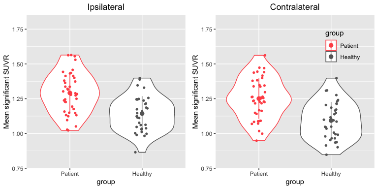<!-- -->

## Figure1.C (supplementary) \| Group Differences in MK-6240 SUVR by sex.

## Figure.3A \| Tau MK-6240 SUVR and clinical relationships

Scatter plot display of the relationship of mean MK-6240 SUVR with
behavioral and clinical measures. Duration and age are measured in
*years*, while all the behavioral measurements where z-scores based in
the control group.

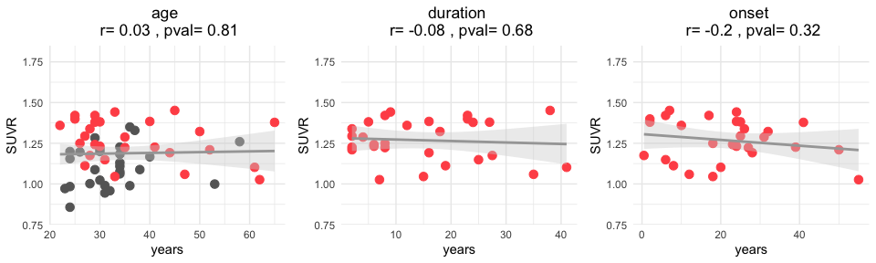<!-- -->

## Correlation with IEDs and GTCS frequency

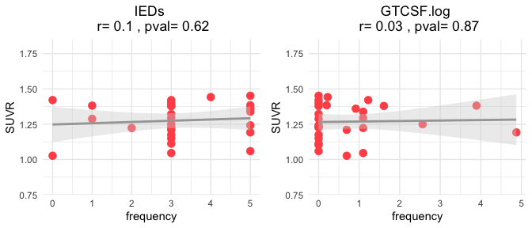<!-- -->

## Figure.3B \| Tau MK-6240 SUVR and behavioural relationships

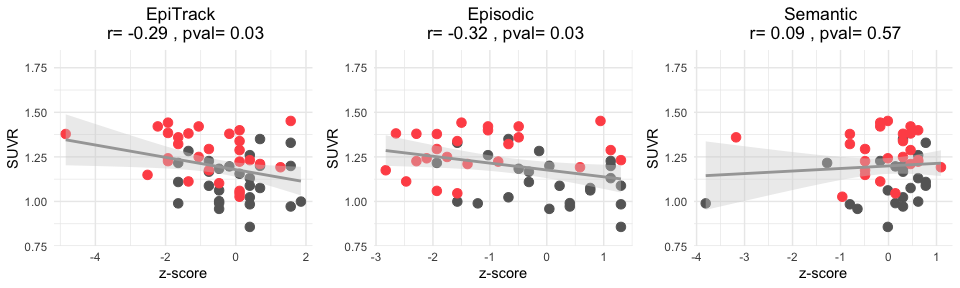<!-- -->

## Figure.3C \| Tau MK-6240 SUVR and hippocampal volume

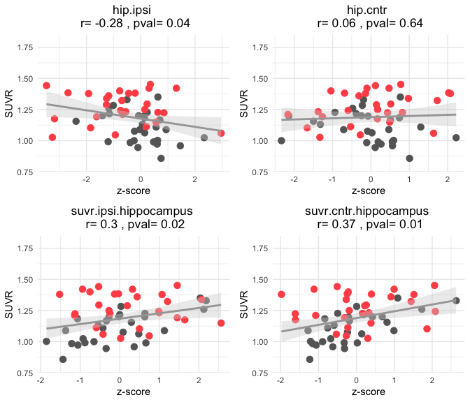<!-- -->

## Supplementary Figure.4 \| Differential trajectories of *18F-MK6240*

Trajectories of $[F^18]MK-6240$ uptake by group between the PET scan
session 1 and 2 in the significant areas. The lines correspond to the
longitudinal subjects.

$$mk6240_{significant} \sim mk6240_{\Delta t} * group + (1 | participant_{id} )$$

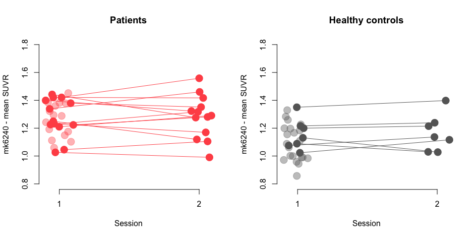<!-- -->

    ## Linear mixed model fit by REML. t-tests use Satterthwaite's method [
    ## lmerModLmerTest]
    ## Formula: mk6240.sig ~ mk6240.Tdiff.yrs * group + (1 | participant_id)
    ##    Data: mk.df
    ## 
    ## REML criterion at convergence: -91.5
    ## 
    ## Scaled residuals: 
    ##      Min       1Q   Median       3Q      Max 
    ## -1.30332 -0.51253  0.01258  0.40999  1.57781 
    ## 
    ## Random effects:
    ##  Groups         Name        Variance Std.Dev.
    ##  participant_id (Intercept) 0.013448 0.11597 
    ##  Residual                   0.003799 0.06163 
    ## Number of obs: 76, groups:  participant_id, 56
    ## 
    ## Fixed effects:
    ##                                Estimate Std. Error        df t value Pr(>|t|)
    ## (Intercept)                    1.112615   0.024741 58.236185  44.970  < 2e-16
    ## mk6240.Tdiff.yrs              -0.004382   0.014754 22.784809  -0.297    0.769
    ## groupPatient                   0.154756   0.035014 58.390867   4.420 4.35e-05
    ## mk6240.Tdiff.yrs:groupPatient  0.010438   0.022114 22.030772   0.472    0.642
    ##                                  
    ## (Intercept)                   ***
    ## mk6240.Tdiff.yrs                 
    ## groupPatient                  ***
    ## mk6240.Tdiff.yrs:groupPatient    
    ## ---
    ## Signif. codes:  0 '***' 0.001 '**' 0.01 '*' 0.05 '.' 0.1 ' ' 1
    ## 
    ## Correlation of Fixed Effects:
    ##             (Intr) mk6240.T. grpPtn
    ## mk6240.Tdf. -0.155                 
    ## groupPatint -0.707  0.109          
    ## mk6240.T.:P  0.103 -0.667    -0.192

    ##  group   mk6240.Tdiff.yrs.trend     SE   df lower.CL upper.CL
    ##  Healthy               -0.00438 0.0149 22.0  -0.0354   0.0266
    ##  Patient                0.00606 0.0166 20.7  -0.0285   0.0407
    ## 
    ## Degrees-of-freedom method: kenward-roger 
    ## Confidence level used: 0.95

No significant interaction (`mk6240.Tdiff.yrs:groupHealthy`, p = 0.769)
was found, suggesting that the rate of change in `mk6240.sig` over time
is not significantly different between the Healthy and Patient groups.

- **Healthy Group**: The estimated slope is `-0.00438` per year (95% CI:
  -0.0354 to 0.0266). This suggests a slight decrease in `mk6240.sig`
  over time, but the change is small and not statistically significant.

- **Patient Group**: The estimated slope is `0.00606` per year (95% CI:
  -0.0285 to 0.0407), indicating a slight increase in `mk6240.sig` over
  time, though this change is also not statistically significant.

There is no strong evidence that `mk6240.sig` changes over time in
either the Healthy or Patient groups, nor that the rate of change
differs significantly between them. However, the significant main effect
of group (p \< 0.001) suggests that `mk6240.sig` is, on average, lower
in the Healthy group compared to Patients.

# Linear mixed effects model of MK-6240 and clinical features

### Full model

$$\text{mk6240}_{\text{sig}} \sim \text{sex} * \text{group} + \text{age} + \text{DRE} + \text{ASM}_{\text{number}} + \text{origin} + \text{duration} + \text{hippocampus}_{\text{ipsi}} + (1 \,|\, \text{participant}_{\text{id}} )$$

### Full model

    ## Linear mixed model fit by REML. t-tests use Satterthwaite's method [
    ## lmerModLmerTest]
    ## Formula: mk6240.sig ~ sex * group + age + dre + asm.number + origin +  
    ##     duration + hip.ipsi + sx.number + (1 | participant_id)
    ##    Data: mk.df
    ## 
    ## REML criterion at convergence: -60.4
    ## 
    ## Scaled residuals: 
    ##      Min       1Q   Median       3Q      Max 
    ## -1.27479 -0.44944 -0.01333  0.44685  1.49173 
    ## 
    ## Random effects:
    ##  Groups         Name        Variance Std.Dev.
    ##  participant_id (Intercept) 0.012945 0.11378 
    ##  Residual                   0.003526 0.05938 
    ## Number of obs: 76, groups:  participant_id, 56
    ## 
    ## Fixed effects:
    ##                     Estimate Std. Error         df t value Pr(>|t|)    
    ## (Intercept)        1.1376106  0.0662276 46.5471196  17.177   <2e-16 ***
    ## sexM               0.1084086  0.0486369 45.0999299   2.229   0.0308 *  
    ## groupPatient       0.2083535  0.1354528 47.6219030   1.538   0.1306    
    ## age               -0.0024555  0.0018433 46.2281388  -1.332   0.1894    
    ## dreno              0.0254907  0.0751188 42.4719395   0.339   0.7360    
    ## asm.number        -0.0382203  0.0201366 44.4408981  -1.898   0.0642 .  
    ## originmTLE         0.0434539  0.1464635 46.6871263   0.297   0.7680    
    ## originTLE          0.0914823  0.1389360 47.3324093   0.658   0.5134    
    ## duration          -0.0002317  0.0024269 43.8557136  -0.095   0.9244    
    ## hip.ipsi          -0.0093854  0.0146005 43.0566202  -0.643   0.5238    
    ## sx.number          0.0257061  0.0668480 41.3840768   0.385   0.7025    
    ## sexM:groupPatient -0.1488841  0.0732232 44.0010140  -2.033   0.0481 *  
    ## ---
    ## Signif. codes:  0 '***' 0.001 '**' 0.01 '*' 0.05 '.' 0.1 ' ' 1
    ## 
    ## Correlation of Fixed Effects:
    ##             (Intr) sexM   grpPtn age    dreno  asm.nm orgnmTLE orignTLE duratn
    ## sexM        -0.219                                                            
    ## groupPatint -0.173  0.177                                                     
    ## age         -0.858 -0.166  0.048                                              
    ## dreno       -0.111 -0.026 -0.031  0.131                                       
    ## asm.number  -0.102 -0.029 -0.123  0.122  0.410                                
    ## originmTLE   0.114  0.021 -0.832 -0.132 -0.028  0.112                         
    ## originTLE    0.097  0.017 -0.858 -0.113  0.021 -0.027  0.908                  
    ## duration     0.190  0.033 -0.079 -0.220 -0.267 -0.277 -0.201   -0.182         
    ## hip.ipsi    -0.219  0.043  0.120  0.223 -0.020 -0.073 -0.041   -0.043   -0.086
    ## sx.number   -0.133 -0.014  0.043  0.150 -0.104 -0.270 -0.281   -0.073    0.145
    ## sxM:grpPtnt  0.099 -0.671 -0.115  0.164 -0.231 -0.141 -0.203   -0.178    0.221
    ##             hip.ps sx.nmb
    ## sexM                     
    ## groupPatint              
    ## age                      
    ## dreno                    
    ## asm.number               
    ## originmTLE               
    ## originTLE                
    ## duration                 
    ## hip.ipsi                 
    ## sx.number    0.165       
    ## sxM:grpPtnt  0.008  0.098
    ## fit warnings:
    ## fixed-effect model matrix is rank deficient so dropping 2 columns / coefficients

## Tuned model

$$\text{mk6240}_{\text{sig}} \sim \text{sex} * \text{group} + \text{age} + \text{ASM}_{\text{number}} + (1 \,|\, \text{participant}_{\text{id}} )$$

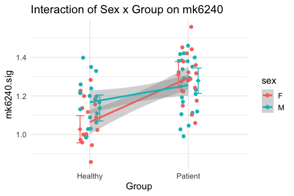<!-- -->

    ## Linear mixed model fit by REML. t-tests use Satterthwaite's method [
    ## lmerModLmerTest]
    ## Formula: mk6240.sig ~ sex * group + age + asm.number + (1 | participant_id)
    ##    Data: mk.df
    ## 
    ## REML criterion at convergence: -89.3
    ## 
    ## Scaled residuals: 
    ##      Min       1Q   Median       3Q      Max 
    ## -1.30547 -0.47524 -0.02096  0.46864  1.58552 
    ## 
    ## Random effects:
    ##  Groups         Name        Variance Std.Dev.
    ##  participant_id (Intercept) 0.011443 0.10697 
    ##  Residual                   0.003551 0.05959 
    ## Number of obs: 76, groups:  participant_id, 56
    ## 
    ## Fixed effects:
    ##                    Estimate Std. Error        df t value Pr(>|t|)    
    ## (Intercept)        1.132107   0.059453 52.615095  19.042  < 2e-16 ***
    ## sexM               0.110408   0.046211 51.028554   2.389   0.0206 *  
    ## groupPatient       0.282843   0.051746 50.316905   5.466 1.44e-06 ***
    ## age               -0.002315   0.001630 52.356907  -1.420   0.1615    
    ## asm.number        -0.036142   0.015615 48.542674  -2.315   0.0249 *  
    ## sexM:groupPatient -0.141374   0.065595 49.463316  -2.155   0.0360 *  
    ## ---
    ## Signif. codes:  0 '***' 0.001 '**' 0.01 '*' 0.05 '.' 0.1 ' ' 1
    ## 
    ## Correlation of Fixed Effects:
    ##             (Intr) sexM   grpPtn age    asm.nm
    ## sexM        -0.239                            
    ## groupPatint -0.089  0.491                     
    ## age         -0.838 -0.171 -0.302              
    ## asm.number  -0.079 -0.016 -0.389  0.095       
    ## sxM:grpPtnt  0.083 -0.722 -0.678  0.222  0.015

# Subcortical MK-6240 SUVR analysis

| **Subcortical SUVR** | **Patient** N = 41 | **Healthy** N = 35 | **Statistic** | **p-value** |
|:---------------------|:------------------:|:------------------:|:-------------:|:-----------:|
| ipsi.thalamus        |     0.15±0.98      |     0.00±1.00      |     0.673     |     0.5     |
| ipsi.caudate         |     0.20±1.06      |     0.00±1.00      |     0.845     |     0.4     |
| ipsi.putamen         |     0.33±1.14      |     0.00±1.00      |     1.34      |     0.2     |
| ipsi.pallidus        |     0.22±1.12      |     0.00±1.00      |     0.895     |     0.4     |
| ipsi.amygdala        |     0.26±1.31      |     0.00±1.00      |     0.972     |     0.3     |
| ipsi.hippocampus     |     0.10±1.14      |     0.00±1.00      |     0.412     |     0.7     |
| ipsi.accumbens       |     0.09±0.91      |     0.00±1.00      |     0.411     |     0.7     |
| cntr.thalamus        |     0.28±0.92      |     0.00±1.00      |     1.27      |     0.2     |
| cntr.caudate         |     0.19±0.94      |     0.00±1.00      |     0.870     |     0.4     |
| cntr.putamen         |     0.34±0.96      |     0.00±1.00      |     1.50      |    0.14     |
| cntr.pallidus        |     0.17±1.09      |     0.00±1.00      |     0.718     |     0.5     |
| cntr.amygdala        |     0.30±1.03      |     0.00±1.00      |     1.28      |     0.2     |
| cntr.hippocampus     |     -0.09±1.09     |     0.00±1.00      |    -0.370     |     0.7     |
| cntr.accumbens       |     0.07±0.94      |     0.00±1.00      |     0.292     |     0.8     |

## Subcortical data MEM

    ## Number of significant areas after p-value correction: 0

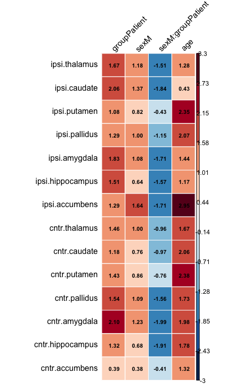<!-- -->

    ## Number of significant areas after p-value correction: 0

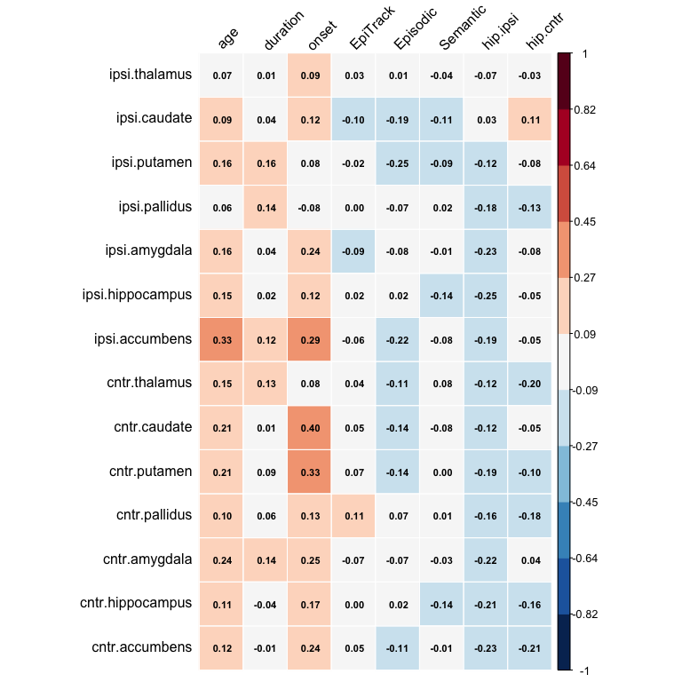<!-- -->

# Clinical database of patients

# Supplementary analysis:

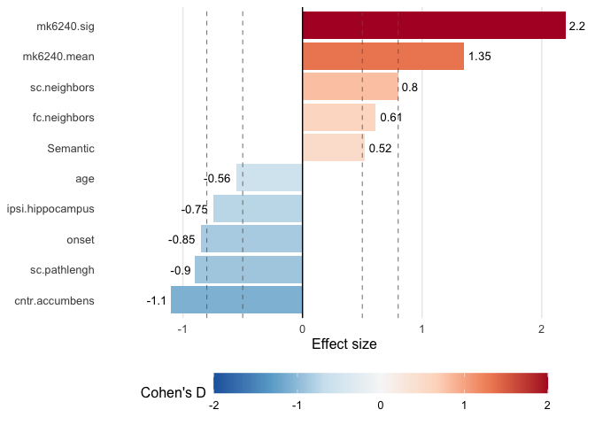<!-- -->

# Supplementary Figure.5 \| MK-6240, behavioral and graph metrics interactons

### MK-6240, behavioral and graph metrics correlogram

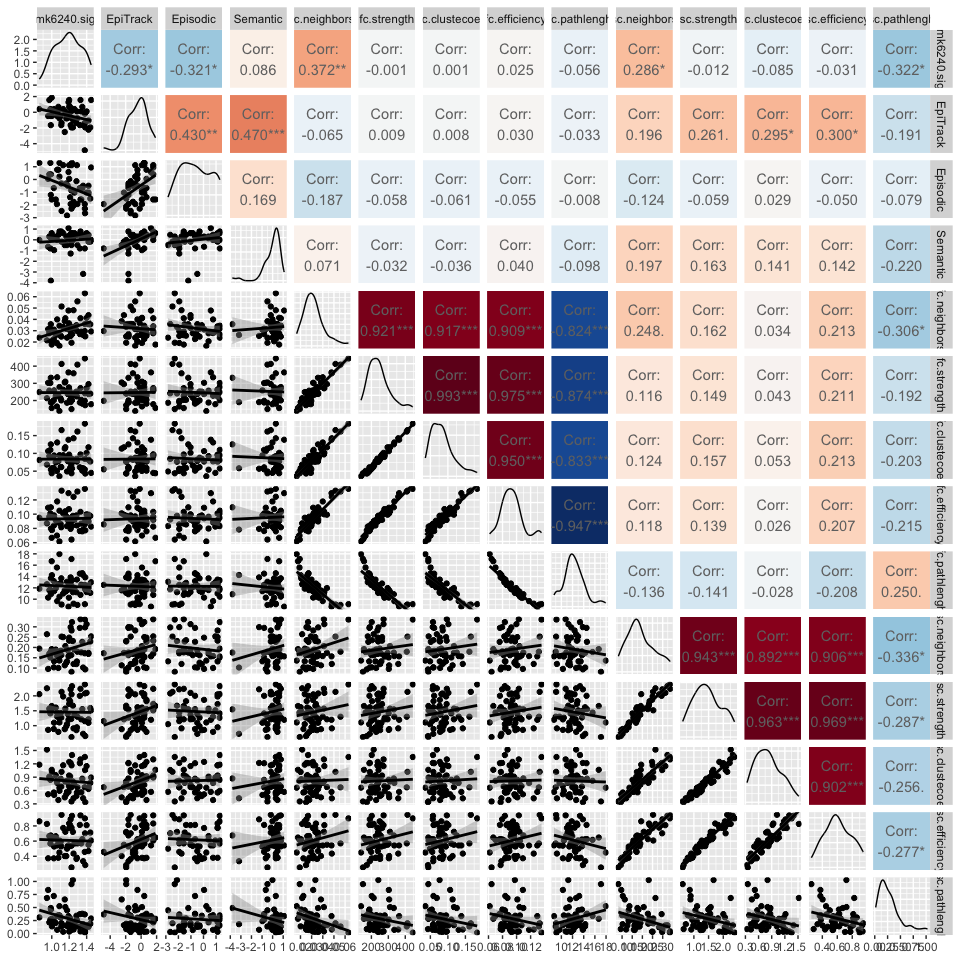<!-- -->

# MK-6240, behavioral and graph metrics SEM

## SEM model for Epitrack

    ## lavaan 0.6-20 ended normally after 1 iteration
    ## 
    ##   Estimator                                         ML
    ##   Optimization method                           NLMINB
    ##   Number of model parameters                         5
    ## 
    ##                                                   Used       Total
    ##   Number of observations                            55          56
    ## 
    ## Model Test User Model:
    ##                                                       
    ##   Test statistic                                 0.000
    ##   Degrees of freedom                                 0
    ## 
    ## Model Test Baseline Model:
    ## 
    ##   Test statistic                                17.487
    ##   Degrees of freedom                                 3
    ##   P-value                                        0.001
    ## 
    ## User Model versus Baseline Model:
    ## 
    ##   Comparative Fit Index (CFI)                    1.000
    ##   Tucker-Lewis Index (TLI)                       1.000
    ## 
    ## Loglikelihood and Information Criteria:
    ## 
    ##   Loglikelihood user model (H0)                 -9.132
    ##   Loglikelihood unrestricted model (H1)         -9.132
    ##                                                       
    ##   Akaike (AIC)                                  28.263
    ##   Bayesian (BIC)                                38.300
    ##   Sample-size adjusted Bayesian (SABIC)         22.588
    ## 
    ## Root Mean Square Error of Approximation:
    ## 
    ##   RMSEA                                          0.000
    ##   90 Percent confidence interval - lower         0.000
    ##   90 Percent confidence interval - upper         0.000
    ##   P-value H_0: RMSEA <= 0.050                       NA
    ##   P-value H_0: RMSEA >= 0.080                       NA
    ## 
    ## Standardized Root Mean Square Residual:
    ## 
    ##   SRMR                                           0.000
    ## 
    ## Parameter Estimates:
    ## 
    ##   Standard errors                            Bootstrap
    ##   Number of requested bootstrap draws             1000
    ##   Number of successful bootstrap draws            1000
    ## 
    ## Regressions:
    ##                    Estimate  Std.Err  z-value  P(>|z|)   Std.lv  Std.all
    ##   sc.neighbors ~                                                        
    ##     mk6240.    (a)    0.150    0.055    2.719    0.007    0.150    0.331
    ##   EpiTrack ~                                                            
    ##     sc.nghb    (b)    6.185    2.336    2.648    0.008    6.185    0.330
    ##     mk6240. (c_pr)   -3.408    1.166   -2.921    0.003   -3.408   -0.402
    ## 
    ## Variances:
    ##                    Estimate  Std.Err  z-value  P(>|z|)   Std.lv  Std.all
    ##    .sc.neighbors      0.004    0.001    6.214    0.000    0.004    0.890
    ##    .EpiTrack          1.242    0.270    4.604    0.000    1.242    0.817
    ## 
    ## Defined Parameters:
    ##                    Estimate  Std.Err  z-value  P(>|z|)   Std.lv  Std.all
    ##     indirect          0.926    0.496    1.866    0.062    0.926    0.109
    ##     total            -2.482    1.166   -2.128    0.033   -2.482   -0.293

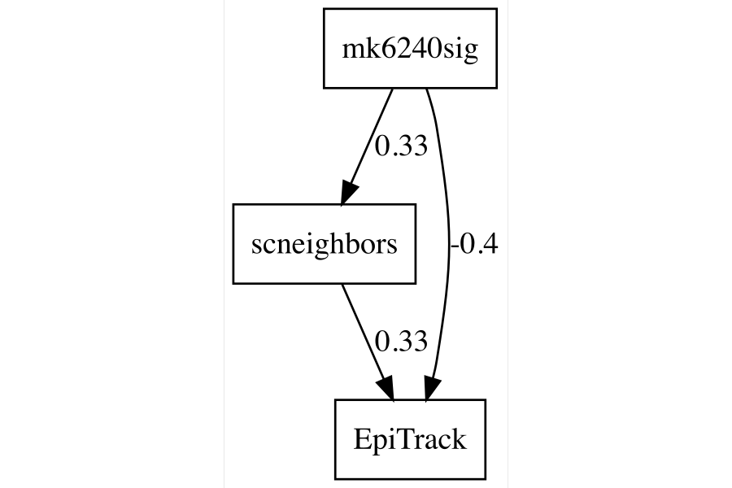

## SEM model for Episodic Memory

    ## lavaan 0.6-20 ended normally after 1 iteration
    ## 
    ##   Estimator                                         ML
    ##   Optimization method                           NLMINB
    ##   Number of model parameters                         5
    ## 
    ##                                                   Used       Total
    ##   Number of observations                            48          56
    ## 
    ## Model Test User Model:
    ##                                                       
    ##   Test statistic                                 0.000
    ##   Degrees of freedom                                 0
    ## 
    ## Model Test Baseline Model:
    ## 
    ##   Test statistic                                12.186
    ##   Degrees of freedom                                 3
    ##   P-value                                        0.007
    ## 
    ## User Model versus Baseline Model:
    ## 
    ##   Comparative Fit Index (CFI)                    1.000
    ##   Tucker-Lewis Index (TLI)                       1.000
    ## 
    ## Loglikelihood and Information Criteria:
    ## 
    ##   Loglikelihood user model (H0)                -10.598
    ##   Loglikelihood unrestricted model (H1)        -10.598
    ##                                                       
    ##   Akaike (AIC)                                  31.195
    ##   Bayesian (BIC)                                40.551
    ##   Sample-size adjusted Bayesian (SABIC)         24.865
    ## 
    ## Root Mean Square Error of Approximation:
    ## 
    ##   RMSEA                                          0.000
    ##   90 Percent confidence interval - lower         0.000
    ##   90 Percent confidence interval - upper         0.000
    ##   P-value H_0: RMSEA <= 0.050                       NA
    ##   P-value H_0: RMSEA >= 0.080                       NA
    ## 
    ## Standardized Root Mean Square Residual:
    ## 
    ##   SRMR                                           0.000
    ## 
    ## Parameter Estimates:
    ## 
    ##   Standard errors                            Bootstrap
    ##   Number of requested bootstrap draws             1000
    ##   Number of successful bootstrap draws             999
    ## 
    ## Regressions:
    ##                    Estimate  Std.Err  z-value  P(>|z|)   Std.lv  Std.all
    ##   sc.neighbors ~                                                        
    ##     mk6240.    (a)    0.167    0.053    3.135    0.002    0.167    0.367
    ##   Episodic ~                                                            
    ##     sc.nghb    (b)   -0.132    2.942   -0.045    0.964   -0.132   -0.007
    ##     mk6240. (c_pr)   -2.658    1.132   -2.348    0.019   -2.658   -0.318
    ## 
    ## Variances:
    ##                    Estimate  Std.Err  z-value  P(>|z|)   Std.lv  Std.all
    ##    .sc.neighbors      0.004    0.001    6.445    0.000    0.004    0.865
    ##    .Episodic          1.366    0.201    6.786    0.000    1.366    0.897
    ## 
    ## Defined Parameters:
    ##                    Estimate  Std.Err  z-value  P(>|z|)   Std.lv  Std.all
    ##     indirect         -0.022    0.520   -0.042    0.966   -0.022   -0.003
    ##     total            -2.680    1.008   -2.659    0.008   -2.680   -0.321

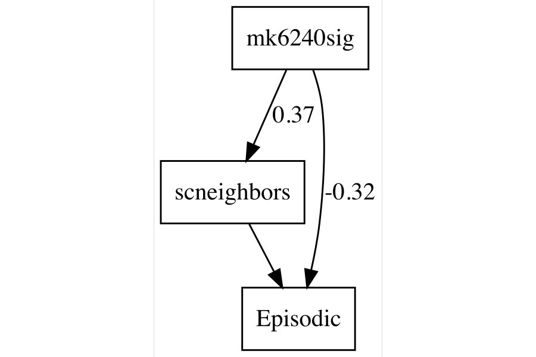

## SEM model for Semantic Memory

    ## lavaan 0.6-20 ended normally after 1 iteration
    ## 
    ##   Estimator                                         ML
    ##   Optimization method                           NLMINB
    ##   Number of model parameters                         5
    ## 
    ##                                                   Used       Total
    ##   Number of observations                            47          56
    ## 
    ## Model Test User Model:
    ##                                                       
    ##   Test statistic                                 0.000
    ##   Degrees of freedom                                 0
    ## 
    ## Model Test Baseline Model:
    ## 
    ##   Test statistic                                 9.791
    ##   Degrees of freedom                                 3
    ##   P-value                                        0.020
    ## 
    ## User Model versus Baseline Model:
    ## 
    ##   Comparative Fit Index (CFI)                    1.000
    ##   Tucker-Lewis Index (TLI)                       1.000
    ## 
    ## Loglikelihood and Information Criteria:
    ## 
    ##   Loglikelihood user model (H0)                  3.042
    ##   Loglikelihood unrestricted model (H1)          3.042
    ##                                                       
    ##   Akaike (AIC)                                   3.916
    ##   Bayesian (BIC)                                13.167
    ##   Sample-size adjusted Bayesian (SABIC)         -2.515
    ## 
    ## Root Mean Square Error of Approximation:
    ## 
    ##   RMSEA                                          0.000
    ##   90 Percent confidence interval - lower         0.000
    ##   90 Percent confidence interval - upper         0.000
    ##   P-value H_0: RMSEA <= 0.050                       NA
    ##   P-value H_0: RMSEA >= 0.080                       NA
    ## 
    ## Standardized Root Mean Square Residual:
    ## 
    ##   SRMR                                           0.000
    ## 
    ## Parameter Estimates:
    ## 
    ##   Standard errors                            Bootstrap
    ##   Number of requested bootstrap draws             1000
    ##   Number of successful bootstrap draws            1000
    ## 
    ## Regressions:
    ##                    Estimate  Std.Err  z-value  P(>|z|)   Std.lv  Std.all
    ##   sc.neighbors ~                                                        
    ##     mk6240.    (a)    0.180    0.055    3.288    0.001    0.180    0.394
    ##   Semantic ~                                                            
    ##     sc.nghb    (b)    2.549    2.368    1.076    0.282    2.549    0.193
    ##     mk6240. (c_pr)    0.059    1.241    0.047    0.962    0.059    0.010
    ## 
    ## Variances:
    ##                    Estimate  Std.Err  z-value  P(>|z|)   Std.lv  Std.all
    ##    .sc.neighbors      0.004    0.001    6.356    0.000    0.004    0.845
    ##    .Semantic          0.771    0.306    2.519    0.012    0.771    0.961
    ## 
    ## Defined Parameters:
    ##                    Estimate  Std.Err  z-value  P(>|z|)   Std.lv  Std.all
    ##     indirect          0.458    0.441    1.040    0.299    0.458    0.076
    ##     total             0.517    1.013    0.510    0.610    0.517    0.086

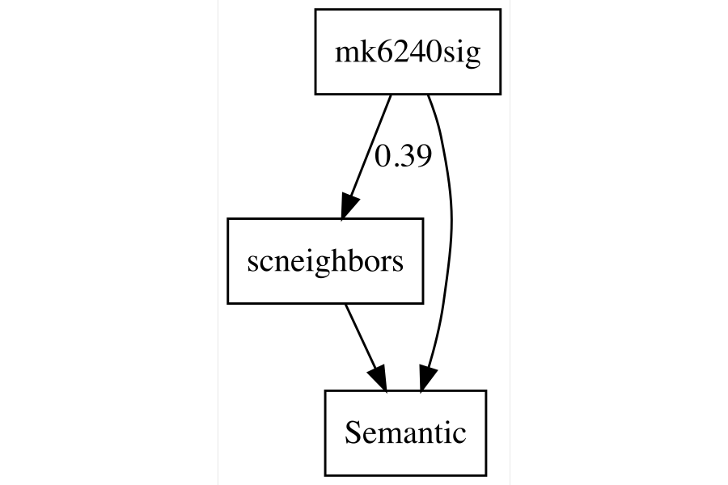

### Full SEM model with multiple mediators and outcomes

> Note: for rendering purposes the number of booststraps was set to
> 1000, but the final version was run with 10000 for a stable estimates
> of the indirect effects.

    ## lavaan 0.6-20 ended normally after 40 iterations
    ## 
    ##   Estimator                                         ML
    ##   Optimization method                           NLMINB
    ##   Number of model parameters                        20
    ## 
    ##                                                   Used       Total
    ##   Number of observations                            44          56
    ## 
    ## Model Test User Model:
    ##                                                       
    ##   Test statistic                                 0.000
    ##   Degrees of freedom                                 0
    ## 
    ## Model Test Baseline Model:
    ## 
    ##   Test statistic                               148.425
    ##   Degrees of freedom                                15
    ##   P-value                                        0.000
    ## 
    ## User Model versus Baseline Model:
    ## 
    ##   Comparative Fit Index (CFI)                    1.000
    ##   Tucker-Lewis Index (TLI)                       1.000
    ## 
    ## Loglikelihood and Information Criteria:
    ## 
    ##   Loglikelihood user model (H0)                -59.515
    ##   Loglikelihood unrestricted model (H1)        -59.515
    ##                                                       
    ##   Akaike (AIC)                                 159.030
    ##   Bayesian (BIC)                               194.714
    ##   Sample-size adjusted Bayesian (SABIC)        132.042
    ## 
    ## Root Mean Square Error of Approximation:
    ## 
    ##   RMSEA                                          0.000
    ##   90 Percent confidence interval - lower         0.000
    ##   90 Percent confidence interval - upper         0.000
    ##   P-value H_0: RMSEA <= 0.050                       NA
    ##   P-value H_0: RMSEA >= 0.080                       NA
    ## 
    ## Standardized Root Mean Square Residual:
    ## 
    ##   SRMR                                           0.000
    ## 
    ## Parameter Estimates:
    ## 
    ##   Standard errors                            Bootstrap
    ##   Number of requested bootstrap draws             1000
    ##   Number of successful bootstrap draws             994
    ## 
    ## Regressions:
    ##                    Estimate  Std.Err  z-value  P(>|z|)   Std.lv  Std.all
    ##   sc.neighbors ~                                                        
    ##     mk6240.s  (a1)    0.170    0.055    3.071    0.002    0.170    0.378
    ##   sc.efficiency ~                                                       
    ##     mk6240.s  (a2)    0.053    0.165    0.319    0.750    0.053    0.045
    ##   EpiTrack ~                                                            
    ##     sc.nghbr (b11)    9.942    8.909    1.116    0.264    9.942    0.534
    ##     sc.ffcnc (b12)   -1.919    3.341   -0.574    0.566   -1.919   -0.267
    ##     mk6240.s  (c1)   -4.078    1.529   -2.668    0.008   -4.078   -0.486
    ##   Episodic ~                                                            
    ##     sc.nghbr (b21)   10.619   10.856    0.978    0.328   10.619    0.586
    ##     sc.ffcnc (b22)   -3.974    3.847   -1.033    0.302   -3.974   -0.567
    ##     mk6240.s  (c2)   -4.509    1.569   -2.875    0.004   -4.509   -0.552
    ##   Semantic ~                                                            
    ##     sc.nghbr (b31)    7.570    5.869    1.290    0.197    7.570    0.567
    ##     sc.ffcnc (b32)   -1.957    1.806   -1.083    0.279   -1.957   -0.379
    ##     mk6240.s  (c3)   -0.835    1.371   -0.609    0.543   -0.835   -0.139
    ## 
    ## Covariances:
    ##                    Estimate  Std.Err  z-value  P(>|z|)   Std.lv  Std.all
    ##  .sc.neighbors ~~                                                       
    ##    .sc.efficiency     0.011    0.002    6.060    0.000    0.011    0.954
    ##  .EpiTrack ~~                                                           
    ##    .Episodic          0.496    0.189    2.628    0.009    0.496    0.373
    ##    .Semantic          0.523    0.169    3.091    0.002    0.523    0.501
    ##  .Episodic ~~                                                           
    ##    .Semantic          0.192    0.133    1.446    0.148    0.192    0.189
    ## 
    ## Variances:
    ##                    Estimate  Std.Err  z-value  P(>|z|)   Std.lv  Std.all
    ##    .sc.neighbors      0.004    0.001    6.151    0.000    0.004    0.857
    ##    .sc.efficiency     0.031    0.005    6.097    0.000    0.031    0.998
    ##    .EpiTrack          1.369    0.337    4.065    0.000    1.369    0.848
    ##    .Episodic          1.293    0.202    6.401    0.000    1.293    0.844
    ##    .Semantic          0.797    0.327    2.436    0.015    0.797    0.957
    ## 
    ## Defined Parameters:
    ##                    Estimate  Std.Err  z-value  P(>|z|)   Std.lv  Std.all
    ##     ind_Eptrck_ngh    1.694    1.639    1.033    0.302    1.694    0.202
    ##     ind_Eptrck_ffc   -0.101    0.641   -0.158    0.875   -0.101   -0.012
    ##     ind_Eptrck_ttl    1.592    1.308    1.217    0.224    1.592    0.190
    ##     ind_Epsdc_nghb    1.809    1.976    0.916    0.360    1.809    0.221
    ##     ind_Epsdc_ffcn   -0.210    0.914   -0.229    0.819   -0.210   -0.026
    ##     ind_Episdc_ttl    1.600    1.643    0.973    0.330    1.600    0.196
    ##     ind_Smntc_nghb    1.290    1.048    1.230    0.219    1.290    0.214
    ##     ind_Smntc_ffcn   -0.103    0.455   -0.227    0.820   -0.103   -0.017
    ##     ind_Semntc_ttl    1.186    0.881    1.347    0.178    1.186    0.197
    ##     total_Epitrack   -2.486    1.349   -1.843    0.065   -2.486   -0.296
    ##     total_Episodic   -2.910    1.068   -2.725    0.006   -2.910   -0.356
    ##     total_Semantic    0.351    1.023    0.343    0.731    0.351    0.058

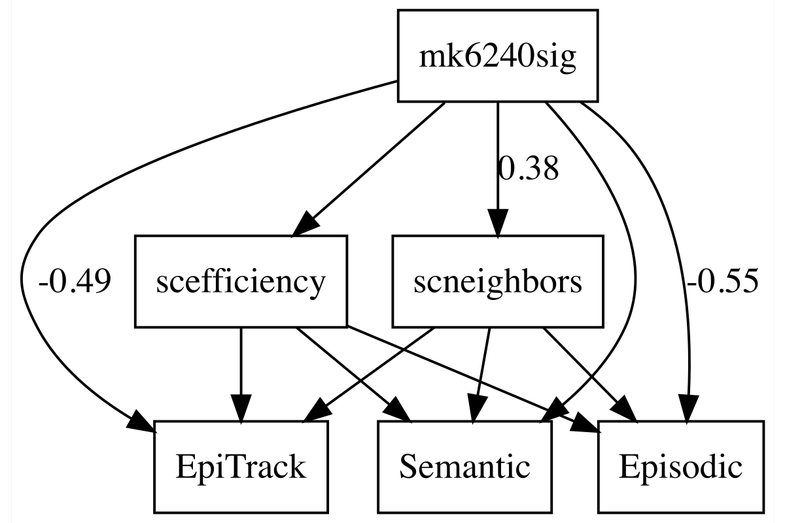

### Full SEM model with multiple mediators and outcomes and ipsilateralhippocampal volume

    ## lavaan 0.6-20 ended normally after 43 iterations
    ## 
    ##   Estimator                                         ML
    ##   Optimization method                           NLMINB
    ##   Number of model parameters                        27
    ## 
    ##                                                   Used       Total
    ##   Number of observations                            44          56
    ## 
    ## Model Test User Model:
    ##                                                       
    ##   Test statistic                                 0.000
    ##   Degrees of freedom                                 0
    ## 
    ## Model Test Baseline Model:
    ## 
    ##   Test statistic                               156.826
    ##   Degrees of freedom                                21
    ##   P-value                                        0.000
    ## 
    ## User Model versus Baseline Model:
    ## 
    ##   Comparative Fit Index (CFI)                    1.000
    ##   Tucker-Lewis Index (TLI)                       1.000
    ## 
    ## Loglikelihood and Information Criteria:
    ## 
    ##   Loglikelihood user model (H0)               -121.676
    ##   Loglikelihood unrestricted model (H1)       -121.676
    ##                                                       
    ##   Akaike (AIC)                                 297.352
    ##   Bayesian (BIC)                               345.525
    ##   Sample-size adjusted Bayesian (SABIC)        260.918
    ## 
    ## Root Mean Square Error of Approximation:
    ## 
    ##   RMSEA                                          0.000
    ##   90 Percent confidence interval - lower         0.000
    ##   90 Percent confidence interval - upper         0.000
    ##   P-value H_0: RMSEA <= 0.050                       NA
    ##   P-value H_0: RMSEA >= 0.080                       NA
    ## 
    ## Standardized Root Mean Square Residual:
    ## 
    ##   SRMR                                           0.000
    ## 
    ## Parameter Estimates:
    ## 
    ##   Standard errors                            Bootstrap
    ##   Number of requested bootstrap draws             1000
    ##   Number of successful bootstrap draws             992
    ## 
    ## Regressions:
    ##                    Estimate  Std.Err  z-value  P(>|z|)   Std.lv  Std.all
    ##   sc.neighbors ~                                                        
    ##     mk6240.s  (a1)    0.170    0.055    3.077    0.002    0.170    0.378
    ##   sc.efficiency ~                                                       
    ##     mk6240.s  (a2)    0.053    0.165    0.320    0.749    0.053    0.045
    ##   hip.ipsi ~                                                            
    ##     mk6240.s  (a3)   -2.266    1.165   -1.945    0.052   -2.266   -0.314
    ##   EpiTrack ~                                                            
    ##     sc.nghbr (b11)    8.915   10.093    0.883    0.377    8.915    0.479
    ##     sc.ffcnc (b12)   -1.482    3.913   -0.379    0.705   -1.482   -0.206
    ##     hip.ipsi (b13)    0.088    0.211    0.416    0.678    0.088    0.076
    ##     mk6240.s  (c1)   -3.727    1.774   -2.101    0.036   -3.727   -0.444
    ##   Episodic ~                                                            
    ##     sc.nghbr (b21)    9.510   11.258    0.845    0.398    9.510    0.525
    ##     sc.ffcnc (b22)   -3.502    4.136   -0.847    0.397   -3.502   -0.500
    ##     hip.ipsi (b23)    0.095    0.193    0.493    0.622    0.095    0.084
    ##     mk6240.s  (c2)   -4.130    1.817   -2.273    0.023   -4.130   -0.506
    ##   Semantic ~                                                            
    ##     sc.nghbr (b31)    6.897    6.208    1.111    0.267    6.897    0.516
    ##     sc.ffcnc (b32)   -1.671    2.043   -0.818    0.414   -1.671   -0.324
    ##     hip.ipsi (b33)    0.058    0.114    0.506    0.613    0.058    0.069
    ##     mk6240.s  (c3)   -0.605    1.308   -0.463    0.644   -0.605   -0.100
    ## 
    ## Covariances:
    ##                    Estimate  Std.Err  z-value  P(>|z|)   Std.lv  Std.all
    ##  .sc.neighbors ~~                                                       
    ##    .sc.efficiency     0.011    0.002    6.069    0.000    0.011    0.954
    ##    .hip.ipsi         -0.006    0.008   -0.778    0.436   -0.006   -0.095
    ##  .sc.efficiency ~~                                                      
    ##    .hip.ipsi         -0.031    0.022   -1.424    0.154   -0.031   -0.167
    ##  .EpiTrack ~~                                                           
    ##    .Episodic          0.488    0.184    2.651    0.008    0.488    0.369
    ##    .Semantic          0.518    0.169    3.055    0.002    0.518    0.498
    ##  .Episodic ~~                                                           
    ##    .Semantic          0.186    0.137    1.364    0.172    0.186    0.185
    ## 
    ## Variances:
    ##                    Estimate  Std.Err  z-value  P(>|z|)   Std.lv  Std.all
    ##    .sc.neighbors      0.004    0.001    6.158    0.000    0.004    0.857
    ##    .sc.efficiency     0.031    0.005    6.104    0.000    0.031    0.998
    ##    .hip.ipsi          1.078    0.263    4.090    0.000    1.078    0.901
    ##    .EpiTrack          1.362    0.313    4.357    0.000    1.362    0.843
    ##    .Episodic          1.284    0.196    6.559    0.000    1.284    0.838
    ##    .Semantic          0.793    0.325    2.438    0.015    0.793    0.953
    ## 
    ## Defined Parameters:
    ##                    Estimate  Std.Err  z-value  P(>|z|)   Std.lv  Std.all
    ##     ind_Eptrck_ngh    1.519    1.867    0.813    0.416    1.519    0.181
    ##     ind_Eptrck_ffc   -0.078    0.769   -0.102    0.919   -0.078   -0.009
    ##     ind_Eptrck_hp_   -0.199    0.570   -0.349    0.727   -0.199   -0.024
    ##     ind_Eptrck_ttl    1.242    1.712    0.725    0.468    1.242    0.148
    ##     ind_Epsdc_nghb    1.620    2.071    0.782    0.434    1.620    0.198
    ##     ind_Epsdc_ffcn   -0.185    0.958   -0.193    0.847   -0.185   -0.023
    ##     ind_Epsdc_hp_p   -0.215    0.485   -0.443    0.658   -0.215   -0.026
    ##     ind_Episdc_ttl    1.220    1.830    0.667    0.505    1.220    0.149
    ##     ind_Smntc_nghb    1.175    1.131    1.039    0.299    1.175    0.195
    ##     ind_Smntc_ffcn   -0.088    0.480   -0.184    0.854   -0.088   -0.015
    ##     ind_Smntc_hp_p   -0.130    0.275   -0.474    0.636   -0.130   -0.022
    ##     ind_Semntc_ttl    0.957    0.982    0.974    0.330    0.957    0.159
    ##     total_Epitrack   -2.486    1.352   -1.839    0.066   -2.486   -0.296
    ##     total_Episodic   -2.910    1.069   -2.723    0.006   -2.910   -0.356
    ##     total_Semantic    0.351    1.021    0.344    0.731    0.351    0.058

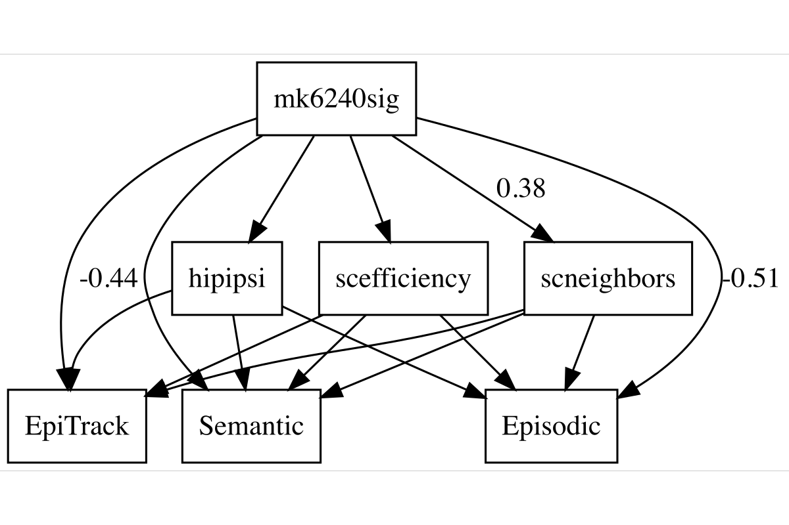
